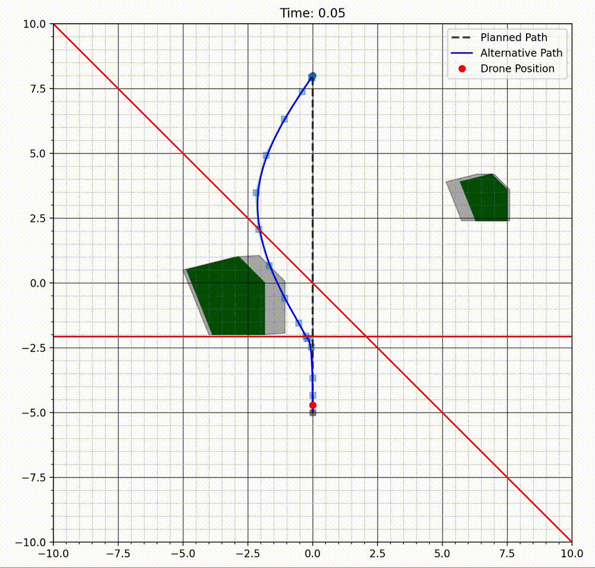
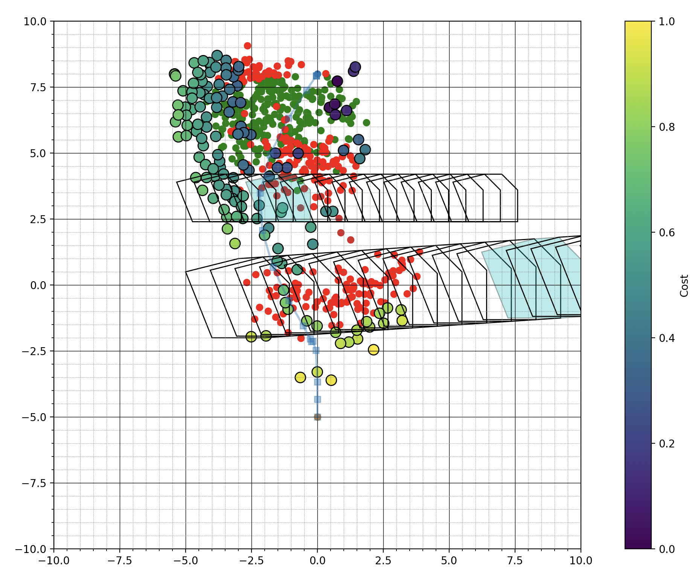

# PyMADER
A python implementation of <a href="https://github.com/mit-acl/mader" target="_blank">MADER</a>, a multi agent drone deconfliction algorithm from MIT. 

## Some Visualisations of the algorithm in action:
<!-- 

  
  

 -->

  

    
    
Agent avoiding two dynamic obstacles with separating planes visible

  

  

    
    
Snapshot showing accepted (green), rejected (red) and unexplored (coloured by relative cost heuristic) control points during the Octopus search

  

